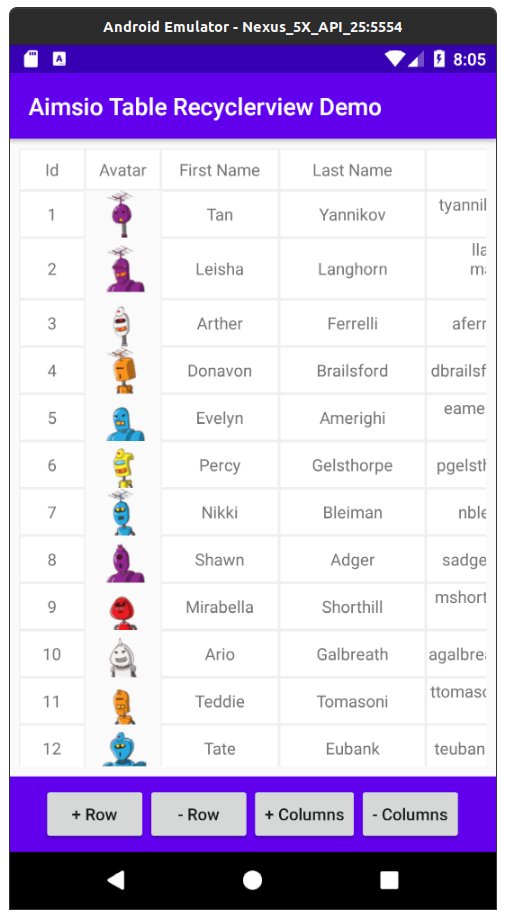
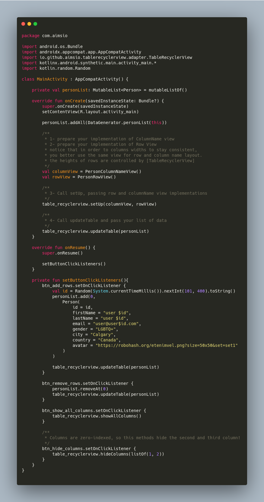

[  ](https://bintray.com/farhad/maven/table-recyclerview/_latestVersion)

```groovy
repositories {
	jcenter()
}
	
implementation 'io.github.aimsio:table-recyclerview:[latest-version]'
```
---

This library provides `TableViewLayout` and `TableViewAdapter` to help create a 2D table representation of any data on Android, enabling consumer classes to use
different custom cell layouts of their own logic and desire.

This library provides `TableRecyclerView` to help create a 2D tabular representation of any data, using recyclerview in Android.

#### The benefits of our TableRecyclerView

1. fluent and easy to understand api.

2. lightweight library size.

3. maximum flexibility in enabling the consumer to use different logic and views for each column.

4. Handling row heights automatically

5. Enabling the rows to use Android DiffUtil for handling data updates in UI.

6. Providing access to the whole model object of the row.


#### The integration process

1. make your data model extend `TableModel`. This is just a marker interface and won't affect your design of classes.

2. implement `TableColumnNameView` providing a single row layout that will host the column names in the table

3. implement `TableRowView` providing the general layout for your data in the table. Notice that `TableRecyclerView` will
   handle row height, but columns width are up to you to handle. So it's recommended to use the same layout structure for 
   `TableColumnNameView` and `TableRowView`. Take a look at demo app for understanding this part.

4. Call `TableRecyclerView.setUp()`, passing your implementations of `TableColumnNameView` and `TableRowView`

5. Call `TableRecyclerView.updateTable()` with a list of your model data.



### License

    Copyright (C) 2020  Farhad Faghihi

    This program is free software: you can redistribute it and/or modify
    it under the terms of the GNU General Public License as published by
    the Free Software Foundation, either version 3 of the License, or
    (at your option) any later version.

    This program is distributed in the hope that it will be useful,
    but WITHOUT ANY WARRANTY; without even the implied warranty of
    MERCHANTABILITY or FITNESS FOR A PARTICULAR PURPOSE.  See the
    GNU General Public License for more details.

    You should have received a copy of the GNU General Public License
    along with this program.  If not, see <http://www.gnu.org/licenses/>.
